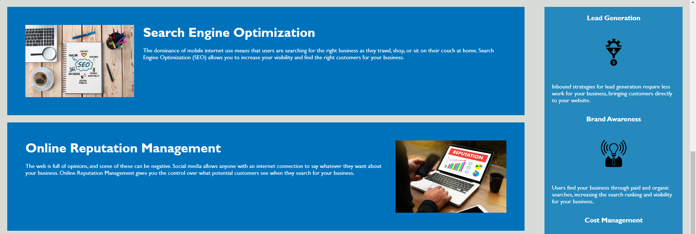
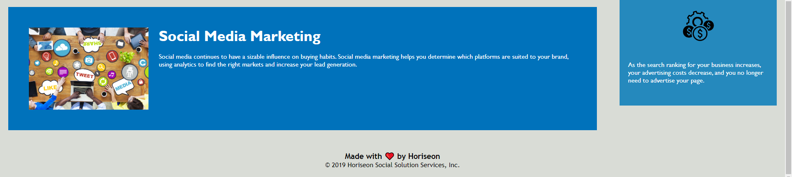

# Optimized Webpage For Marketing Agency

## Table of Contents
* [Screenshot of page](#screenshot)
* [Information](#information)
* [Installation](#installation)
* [Credits](#credits)
* [License](#license)
* [Tests](#tests)

## Screenshot

## Information
This page was given to me by the edX bootcamp: Skills Boot Camp in Front-End Web Development
My task was to optimize this webpage in order to improve the HTML and CSS documents
I have replaced multiple DIVs with semantic HTML elements
I added ALT text to each image and icon in the webpage
I changed the structure of the HTML elements to sequentially structure the header tags
I added a title to this HTML page
I fixed the first link in the HTML page which was not displaying the correct Anchor Link
I added comments to the HTML and CSS documents

## Installation
Click on this link: https://programmer90000.github.io/optimized-webpage-for-marketing-agency/

## Credits
The original page without any optimization was from the edX bootcamp: Skills Boot Camp in Front-End Web Development

## License
GNU GENERAL PUBLIC LICENSE (GPL) version 3.0

## Tests
Click on each individual Anchor Link and ensure it moves to the correct part of the page